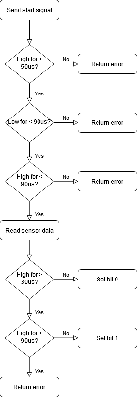

# WifiSend

## DHT
The DHT11 sensor is read every 2 seconds using interrupts and the values are stored in the global uint8_t array **sensorData**.

The DHT11 is set up on timer 3 with the following values.
|Timer   |Mode|OCR3A|Prescaler|
|--------|----|-----|---------|
|Timer 3 |0   |31248‬|1024     |

- T=1f=116M=62.5ns
- (Tdelay / (Tcpu * Prescaler)) - 1 = (2s / (62,5nSek * 1024)) - 1 = 31249
----
The following diagram shows the overall flow of the DHT sensor


## ESP8266

For the ESP8266 it is important to write the HTTP message correctly. If the message does not have the correct format, it is rejected by the API.

```c
	sprintf(_buffer, "GET /iot/uploadData?Key=%s&SensorId=1&Name=%s&Data=%d.%d HTTP/1.1\r\nhost: %s:%s\r\n", API_WRITE_KEY, sensor, sensorData[sensorRead], sensorData[sensorRead + 1], DOMAIN, PORT);
```
The minimum required information is as follows
- **Method**
- **HTTP Protocol Version**
- **Host & Port**
- **End with double newline**

Note that the ESP8266 library adds one newline at the end of every message sent, so in the example above there is only one newline added.

# API

- **IP:** 40.69.73.113
- **PORT:** 80
- **URI:** GET /iot/uploadData?Key=xx&SensorId=1&Name=zz&Data=11.22

## Storage & Format
All readings are stored in a MongoDB database. Every sensor has its own collection where just the value of the reading and the time of the reading is stored.

The time should automatically be added by the API server, so it is not necessary to include this in the data that is sent from the microcontroller.
